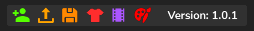

# Changelog
All of Custom-Npc's changes and updates will be listed here.

## V1.2.3 - Importing Update
<!-- ::: details Update Details -->
* Now able to import already made npcs into the editor.
* Topbar icons changed. (New Import Button, Some icons changed and shifted)
* Minor changes to the UI to enhance the experience of Custom-Npc.
* Some bug fixes that have been found have also been fixed.
<!-- ::: -->

## V1.1.3

<!-- ::: details Update Details -->
* Minor changes to the UI to enhance Custom-Npc
<!-- ::: -->

## V1.1.2 - Search Bar Update

<!-- ::: details Update Details -->
* A new feature has been added to Custom-Npc which helps you search for a character quickly in the saved characters list!

Here’s a quick example:

<video controls='controls' src='./assets/CNpcUpd1.1.2Vid.mp4'></video>
<!-- ::: -->

## V1.0.2 - Bug Fix Update

<!-- ::: details Update Details -->
Just fixed a small patch that seemed unintuitive.

* Patched an annoying warning to users loading R15 characters into workspace without selecting any animations. Npcs still loaded in workspace but just thought about fixing it.

Also, The plugin's price has dropped from 175 robux to 150 robux!
<!-- ::: -->

## V1.0.1

<!-- ::: details Update Details -->
* Rescaled the plugin UI so it doesn’t look distorted when opening Custom-Npc for the first time.
* Issues with the animations frame not showing all of the R15 animation packs has now been fixed.
* New and improved icons to provide a clearer understanding of their functions.

<!-- ::: -->
